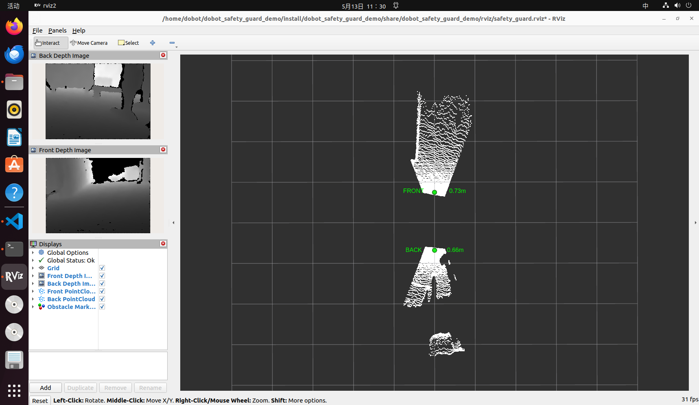
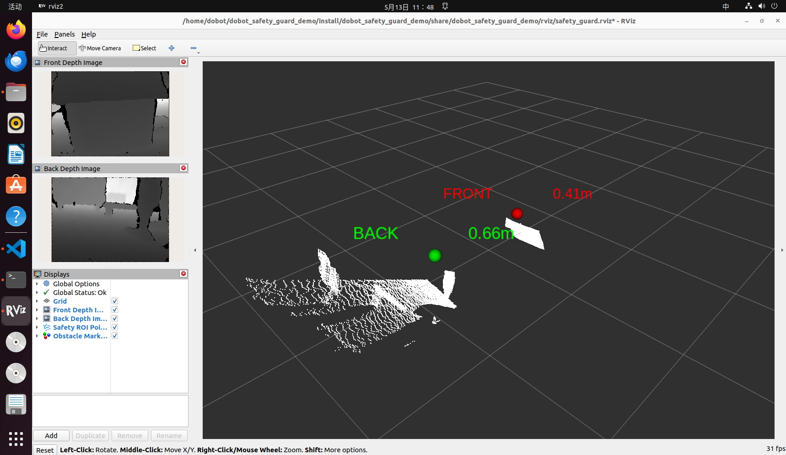
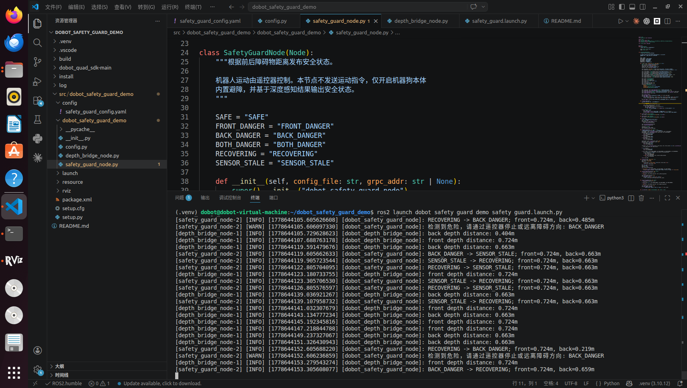

# Dobot 双向避障安全演示

> 文档版本：v1.0
>
> 日期：2026-5-28

------

本工程用于演示 Dobot 四足机器人基于前后深度相机的双向避障安全感知能力。程序通过 DDS 读取前后深度图，计算障碍物距离，并在 ROS 2 与 RViz2 中发布深度图、点云、距离标记和安全状态。

机器人运动由**遥控器**控制。

## 功能

- 订阅前向深度 DDS 话题：`rt/camera/camera2/image_depth`
- 订阅后向深度 DDS 话题：`rt/camera/camera3/image_depth`
- 计算前后 ROI 区域内的障碍物距离
- 发布 ROS 2 深度图、点云、距离、状态和 RViz Marker
- 启动时开启机器狗本体内置避障：`set_obstacle_avoidance(True)`
- 在 RViz2 中显示前后深度图、点云和距离标签
- 当前后距离进入危险阈值时，机器狗会自动触发急停，在控制台和 ROS 2 话题中输出安全状态

## 系统架构

```text
前向深度相机 DDS: rt/camera/camera2/image_depth
后向深度相机 DDS: rt/camera/camera3/image_depth
        │
        ▼
depth_bridge_node
        ├─ 深度图转 ROS 2 Image
        ├─ 深度图生成 PointCloud2
        ├─ ROI 距离计算
        └─ RViz Marker 发布
        │
        ▼
safety_guard_node
        ├─ 开启机器狗本体内置避障
        ├─ 订阅前后障碍物距离
        ├─ 维护安全状态机
        └─ 发布安全状态和事件
```

## 安全状态

| 状态 | 含义 |
| --- | --- |
| `SAFE` | 前后距离均满足安全距离 |
| `FRONT_DANGER` | 前方距离进入危险阈值 |
| `BACK_DANGER` | 后方距离进入危险阈值 |
| `BOTH_DANGER` | 前后距离均进入危险阈值 |
| `RECOVERING` | 障碍物已移开，正在等待恢复稳定时间 |
| `SENSOR_STALE` | 深度数据超时或尚未收到数据 |

## 目录结构

```text
dobot_safety_guard_demo/
├── README.md
├── dobot_quad_sdk-main/                 # Dobot 四足机器人 SDK
└── src/
    └── dobot_safety_guard_demo/
        ├── package.xml
        ├── setup.py
        ├── config/
        │   └── safety_guard_config.yaml
        ├── launch/
        │   └── safety_guard.launch.py
        ├── rviz/
        │   └── safety_guard.rviz
        └── dobot_safety_guard_demo/
            ├── config.py
            ├── depth_bridge_node.py
            └── safety_guard_node.py
```

`build/`、`install/`、`log/` 为 colcon 构建生成，源码以 `src/dobot_safety_guard_demo/` 为准。

## 环境要求

| 项目 | 要求 |
| --- | --- |
| 操作系统 | Ubuntu 22.04 |
| ROS 2 | Humble |
| Python | 3.10 |
| 网络 | 开发机与机器狗通过有线网络连接，位于 `192.168.5.x` 网段 |
| SDK | `dobot_quad_sdk-main` 位于工程根目录 |

默认机器人地址：

```text
192.168.5.2:50051
```

DDS 深度图依赖有线网络连接。使用虚拟机时，连接机器狗的网卡建议设置为桥接模式。

**注：本文命令默认工程路径为 `~/dobot_safety_guard_demo`。如果实际路径不同，请将命令中的路径替换为实际路径。**

## 安装依赖

安装系统依赖：

```bash
sudo apt update
sudo apt install -y python3-venv python3-pip python3-colcon-common-extensions
```

创建并激活虚拟环境：

```bash
cd ~/dobot_safety_guard_demo
python3 -m venv .venv
source .venv/bin/activate
python -m pip install --upgrade pip setuptools wheel
```

后续安装、编译和启动均建议在该虚拟环境中执行，确保 `python` 能同时找到 ROS 2 包、Dobot gRPC SDK 和 DDS Python 依赖。

安装 ROS 2 Python 构建依赖：

```bash
python -m pip install empy==3.3.4 catkin_pkg lark requests pyyaml
```

安装 Dobot 高层 gRPC SDK：

```bash
cd ~/dobot_safety_guard_demo/dobot_quad_sdk-main/high_level/python
python -m pip install -e .
```

验证高层 SDK，若有输出则代表安装成功：

```bash
python -c "import dobot_quad; print(dobot_quad.__file__)"
```

安装 DDS 中间件和 Python 依赖：

```bash
cd ~/dobot_safety_guard_demo/dobot_quad_sdk-main/dist
sudo dpkg -i dds-middleware-with-thirdparty*.deb
export CYCLONEDDS_HOME="/usr/local/"
python -m pip install dds_middleware_python-*.whl
python -m pip install cyclonedds opencv-python numpy pyyaml
```

验证 DDS 依赖：

```bash
python -c "import dds_middleware_python; print('dds ok')"
python -c "import cyclonedds; print('cyclonedds ok')"
```

## 网络配置（适配虚拟机）

确认连接机器狗的有线网卡名称：

```bash
ip a
```

如需手动设置开发机 IP：

```bash
sudo ip addr add 192.168.5.100/24 dev <网卡名>
sudo ip link set <网卡名> up
```

编辑 CycloneDDS 配置：

```bash
nano ~/dobot_safety_guard_demo/dobot_quad_sdk-main/cyclonedds.xml
```

将文件中的网卡名称修改为连接机器狗的有线网卡名。启动前设置：

```bash
export CYCLONEDDS_URI=file:///home/dobot/dobot_safety_guard_demo/dobot_quad_sdk-main/cyclonedds.xml
```

如果工程路径不是 `/home/dobot/dobot_safety_guard_demo`，请替换为实际路径。

验证配置文件路径：

```bash
ls ~/dobot_safety_guard_demo/dobot_quad_sdk-main/cyclonedds.xml
```

## 配置说明

配置文件：

```text
src/dobot_safety_guard_demo/config/safety_guard_config.yaml
```

关键参数：

```yaml
robot:
  grpc_addr: "192.168.5.2:50051"
  enable_builtin_obstacle_avoidance: true

dds:
  config_file: "dobot_quad_sdk-main/low_level/python/config/dds_config.yaml"
  domain_id: 0
  front_depth_topic: "rt/camera/camera2/image_depth"
  back_depth_topic: "rt/camera/camera3/image_depth"

safety:
  front_danger_distance_m: 0.50
  front_recover_distance_m: 0.70
  back_danger_distance_m: 0.50
  back_recover_distance_m: 0.70
  recover_stable_seconds: 2.0
  stale_timeout_seconds: 3.0
  distance_publish_period_seconds: 0.05
  distance_sample_step: 2

visualization:
  pointcloud:
    use_roi_only: true
    sample_step: 4
    max_points: 12000
    publish_period_seconds: 0.2
  depth_image:
    publish_period_seconds: 0.1
```

阈值说明：

- `front_danger_distance_m`：前方危险距离，默认 `0.50m`。
- `front_recover_distance_m`：前方恢复距离，默认 `0.70m`。
- `back_danger_distance_m`：后方危险距离，默认 `0.50m`。
- `back_recover_distance_m`：后方恢复距离，默认 `0.70m`。
- `recover_stable_seconds`：从危险恢复到安全前需要保持稳定的时间。
- `stale_timeout_seconds`：深度数据超时时间。
- `distance_publish_period_seconds`：安全距离处理周期，默认 `0.05s`，即每侧约 20Hz。
- `distance_sample_step`：ROI 距离计算采样步长，默认每 2 个像素采样一次。
- `pointcloud.use_roi_only`：仅发布避障 ROI 区域点云，保证障碍区域清晰并降低 RViz 渲染压力。
- `pointcloud.sample_step`：点云采样步长，数值越小点云越密。
- `pointcloud.publish_period_seconds`：点云发布周期，默认每侧约 5Hz。
- `depth_image.publish_period_seconds`：深度图发布周期，默认约 10Hz。

## 编译

```bash
cd ~/dobot_safety_guard_demo
source .venv/bin/activate
source /opt/ros/humble/setup.bash
colcon build --base-paths src --packages-select dobot_safety_guard_demo
source install/setup.bash
```

**注意：修改源码、配置、launch 或 RViz 文件后，需要重新执行编译。**

## 启动

```bash
cd ~/dobot_safety_guard_demo
source .venv/bin/activate
source /opt/ros/humble/setup.bash
source install/setup.bash
export CYCLONEDDS_URI=file:///home/dobot/dobot_safety_guard_demo/dobot_quad_sdk-main/cyclonedds.xml
ros2 launch dobot_safety_guard_demo safety_guard.launch.py
```

如果上一次运行异常退出，启动前先清理旧进程：

```bash
pkill -f dobot_safety_guard_demo
pkill -f depth_bridge_node
pkill -f safety_guard_node
pkill -f rviz2
```

启动后包含：

- `depth_bridge_node`：订阅 DDS 深度图，发布 ROS 2 图像、点云、距离和 Marker。
- `safety_guard_node`：开启本体内置避障，发布安全状态和事件。
- `rviz2`：显示深度图、点云和障碍物距离。
- 静态 TF：提供 `safety_guard_base`、`front_depth_camera`、`back_depth_camera` 坐标系。

正常日志示例：

```text
前向深度 DDS 话题: rt/camera/camera2/image_depth
后向深度 DDS 话题: rt/camera/camera3/image_depth
已开启机器狗本体内置避障: True
安全状态机已启动
```

## ROS 2 话题

| 话题 | 类型 | 说明 |
| --- | --- | --- |
| `/safety_guard/front/distance` | `std_msgs/Float32` | 前方 ROI 距离 |
| `/safety_guard/back/distance` | `std_msgs/Float32` | 后方 ROI 距离 |
| `/safety_guard/state` | `std_msgs/String` | 当前安全状态 |
| `/safety_guard/events` | `std_msgs/String` | 安全状态切换事件 |
| `/safety_guard/depth_status` | `std_msgs/String` | 深度处理异常信息 |
| `/safety_guard/front/depth/image_raw` | `sensor_msgs/Image` | 前向深度图 |
| `/safety_guard/back/depth/image_raw` | `sensor_msgs/Image` | 后向深度图 |
| `/safety_guard/points` | `sensor_msgs/PointCloud2` | 前后 ROI 合并点云 |
| `/safety_guard/markers` | `visualization_msgs/MarkerArray` | RViz 距离标记 |

实时传感器话题使用 `Best Effort + Keep Last(1)` QoS，RViz 配置文件已同步设置为 Best Effort，避免可视化消费慢时反压安全距离发布。

## RViz 显示

前后深度图以及环境点云：



显示内容：

- `Front Depth Image`：前向深度图。
- `Back Depth Image`：后向深度图。
- `Safety ROI PointCloud`：前后 ROI 合并点云。
- `Obstacle Markers`：前后距离球和文字标签。

Marker 说明：

- 绿色：当前距离大于危险阈值。
- 红色：当前距离小于或等于危险阈值。
- `FRONT xx m`：前向 ROI 计算距离。
- `BACK xx m`：后向 ROI 计算距离。

点云只显示安全 ROI 区域，不显示完整相机画面点云。该设计用于突出避障触发区域，并保证 RViz 长时间运行的实时性。

当障碍物距离小于阈值时，Marker会变成红色以示预警⚠️，同时控制台也会进行相应提示





## 常见问题

### RViz 中深度图显示 No Image

检查 `depth_bridge_node` 是否正常运行，并确认 DDS 网络配置正确。如果控制台出现：

```text
can't open configuration file file:///xxx/cyclonedds.xml
Could not create DomainParticipant
```

说明 `CYCLONEDDS_URI` 路径错误。重新设置：

```bash
unset CYCLONEDDS_URI
export CYCLONEDDS_URI=file:///home/dobot/dobot_safety_guard_demo/dobot_quad_sdk-main/cyclonedds.xml
```

### 无法连接机器人 gRPC

确认开发机和机器狗处于同一有线网段，并检查地址是否可达：

```bash
ping 192.168.5.2
```

如机器人地址不同，启动时覆盖：

```bash
ros2 launch dobot_safety_guard_demo safety_guard.launch.py grpc_addr:=<机器人IP>:50051
```

### 距离显示为 nan

可能原因：

- 深度图未收到。
- ROI 区域内没有有效深度点。
- `min_valid_depth_m` 或 `max_valid_depth_m` 过滤范围不适合当前场景。
- DDS 网络或 CycloneDDS 网卡配置不正确。

### 重新启动后 RViz 或控制台卡顿

先确认没有旧进程残留：

```bash
pkill -f dobot_safety_guard_demo
pkill -f depth_bridge_node
pkill -f safety_guard_node
pkill -f rviz2
```

重新打开终端后按启动流程重新执行 `source .venv/bin/activate`、`source /opt/ros/humble/setup.bash` 和 `source install/setup.bash`。
